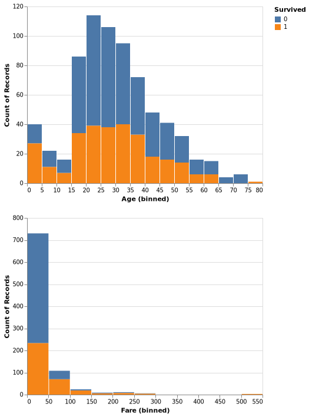

# Approaching a Supervised Classification Problem
This repository is created to give a brief introduction on how to approach a supervised classification problem. Though the problem is classification, the approach can be used for regression problems too.
## Goal
The aim of this repository is not just to achieve the accuracy using any one model. It's more about how you start with the raw data and what tools can be used to get a final solution. I use this repository more like a **revision material** from time to time as I discussed various techniques to get inputs from the data and go over an exhautive list of machine learning algorithms along with my personal notes explaining the algorithm in laymans terms.
## Repository Structure

## Usage
If you want a quick glance, click on the `Notebook.ipynb` which has all the code and outputs with explanations. Or you want to try it on your own, you can download from the github. But I prefer to do it from the command line as I enclosed a `environment.yml` too to give you all the required packages in one shot. The usage steps are:
1. Open your terminal
2. Clone the repoistory using `git clone git@github.com:nvmcr/My_Portfolio.git`.
3. This will create a repository with all my portfolio projects. (sorry if you wanted to clone just the present repo)
4. Enter the present repo using `cd Approaching_SupervisedML_Problem/`.
5. Set up a new virtual environment with all necessary packages and dependencies using `conda env create -f environment.yml`
6. Activate the virtual environment with `conda activate titanic`
6. You can deactivate the virtual environment using `conda deactivate`

## Approach
First things first, we will import necessary libraries and the dataset. As the goal is more about the process than the result, I chose a simple dataset available at Kaggle: https://www.kaggle.com/competitions/titanic/data?select=train.csv
### Exploratory Data Analysis (EDA)
EDA is all about getting the feel of the data. Checking what is inside the dataset, what kind of values, understanding distributions, checking null values, realtionships between the features etc .. It is the most important step in building a model beacuse its all about the data.  
I start by reading the data into a pandas dataframe and go through the data and datatypes. Plots are best way to digest large datasets and get some insights. For example from the graph below, we can see that many passengers are between 20-35 of age and paid below 50$ for the ticket. A few assumptions can also be drawn like most of the infants and high paid passengers survived. Go through the code to look into more details.

##License
Licensed under MIT licence (no restrictions!)
